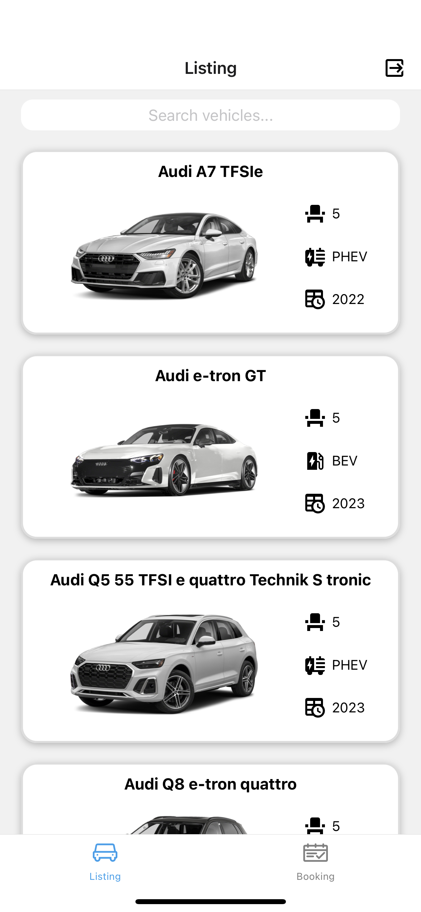
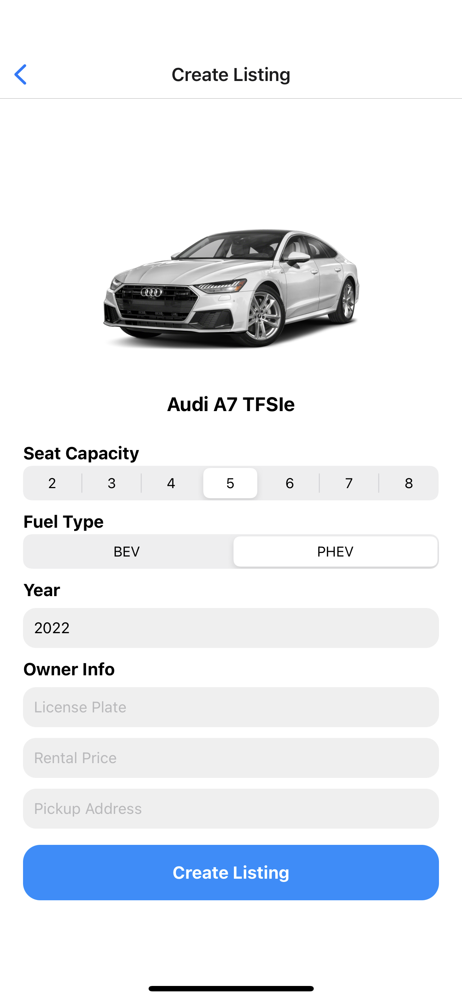
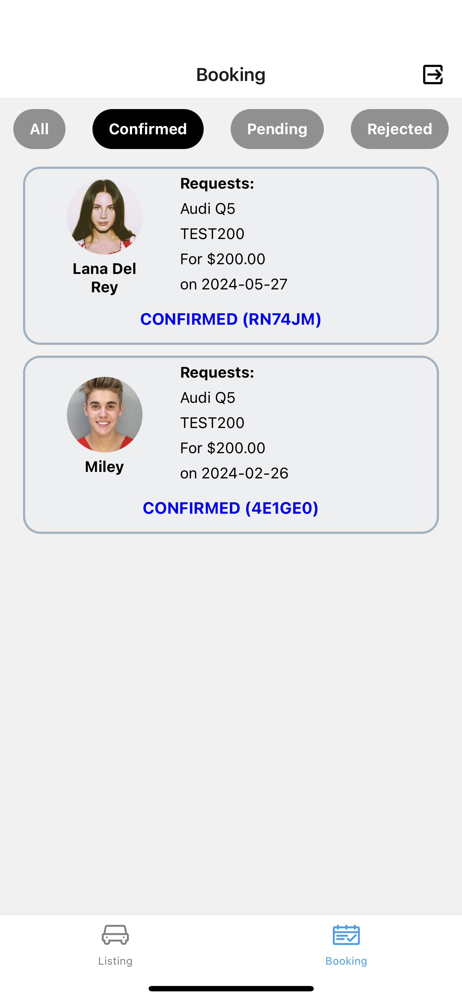
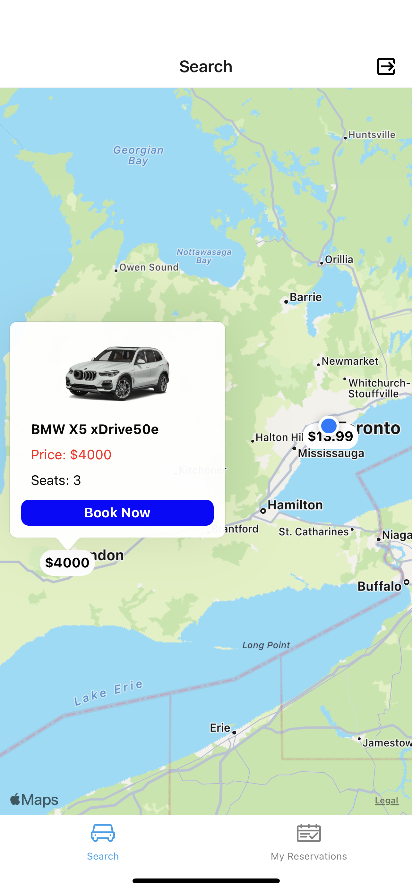
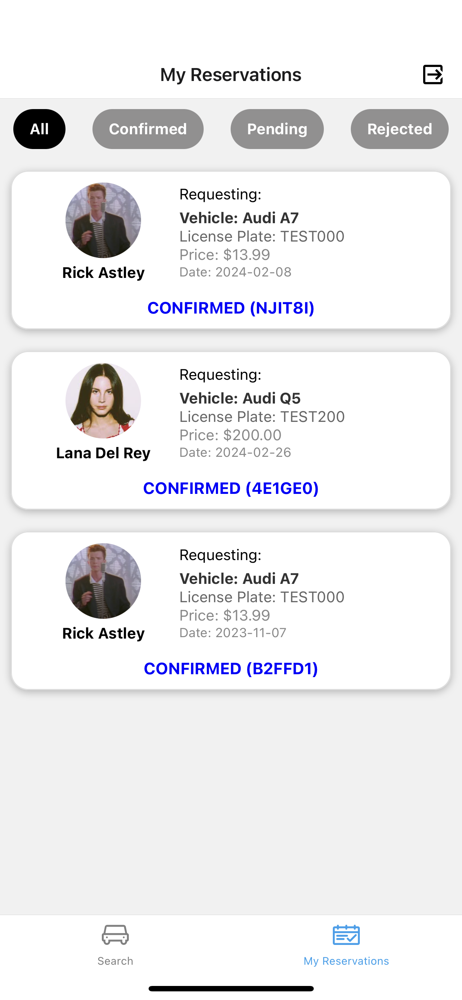

# EV-Renting-App-React-Native
A simplified academic React Native group project that contains Owner and Renter apps for vehicle rental services using expo. 

<br/>

## Description
### Common
For simplicity, user registration function is not provided in both applications.
Refer to the `Schema` Section for Users detail.

<br/>

### Owner App 
This app allows users to create listings and accept or decline booking requests

<br/>

### Renter App
This app allows users to search for listings based on their location, send booking requests, and view booking info.

<br/>

## Usage
```
1. Go to the project directory (OwnerApp / RenterApp) using terminal
2. npm install
3. npx expo start
```

Change the Firebase Configuration in `/configs/dbConfigs.js` on the ***Project Directory*** if the existing one does not work.
Users can be created through Firebase Auth.

<br/>

## Demonstration

### Owner App

<p align="center">

&nbsp; &nbsp; &nbsp; &nbsp;

</p>
<p align="center">Creating Listings</p>

<br/>

<p align="center">

&nbsp; &nbsp; &nbsp; &nbsp;

</p>
<p align="center">View Bookings</p>

<br/>

### Renter App

<p align="center"></p>
<p align="center">Search Listings</p>

<br/>

<p align="center"></p>
<p align="center">View Bookings</p>

<br/>

## Schema

### Owner App

Collection `Listings` is required for creating vehicle listings.

The structure of the `Listing` document in `Listings` is as follows:

```JSON
{
  "name": "Audi e-tron GT ",
  "images": [
    "https://assets.zappyride.com/img/vehicles/chromestyle/419744/style-set-1280/2022AUC400001_1280_01.png",
    "https://assets.zappyride.com/img/vehicles/chromestyle/419744/style-set-1280/2022AUC400002_1280_03.png"
  ],
  "seat": 5,
  "fuel": "BEV",
  "year": 2023,
  "licensePlate": "CLE173",
  "pickupLocation": {
    "address": "Toronto",
    "coordinates": {
      "latitude": 43.6516053,
      "longitude": -79.3831254
    },
    "city": "Toronto"
  },
  "rentalPrice": 55.99,
  "make": "Audi",
  "model": "e-tron GT",
  "ownerUid": "xHn1WJEni2Y9Ol6CMsvaSA6T7ww2"
}
```

<br/>

### Renter App
Collection `Bookings` is required for creating vehicle booking requests. 

The structure of the `Booking` document in `Bookings` is as follows:

```JSON
{
  "listingId": "XJLZ46AzpZ6edC3rAtjZ",
  "renterUid": "AcisuCjCLCTF3W3S1MHGLI5EyWZ2",
  "requestDate": "2023-09-25T07:20:40.957Z",
  "status": "Pending"
}
```

<br/>

### Common Schema

A `User` document should be created following account registration. 
You may implement your own registration page with Firebase Auth's signup function, and add the user info to `Users` Collection. 
This application is implemented with the following user info:
```JSON
{
  "name": "Miley",
  "image": "https://cdn.thenet.ng/wp-content/uploads/2014/01/Justin-Biebers-mugshot.jpg"
}
```
For simplicity, the image is implemented as a String.

<br/>

### Getting Booking Information

Each `Booking` contains a listingId for retrieving the `Listing` from Collection `Listings`.

With `Listing.ownerUid`, the owner info can be retrieved from Collection `Users`.

The following JSON object is then constructed for showing the user's `Bookings`:

```JSON
{
  "id": "xJLzYM0iSvAIo8WlmBUq",
  "vehicle": {
    "listingId": "XJLZ46AzpZ6edC3rAtjZ",
    "images": [
      "https://assets.zappyride.com/img/vehicles/chromestyle/422726/style-set-1280/2022AUC390001_1280_01.png",
      "https://assets.zappyride.com/img/vehicles/chromestyle/422726/style-set-1280/2022AUC390003_1280_03.png",
      "https://assets.zappyride.com/img/vehicles/chromestyle/422726/style-set-1280/2022AUC390004_1280_05.png",
      "https://assets.zappyride.com/img/vehicles/chromestyle/422726/style-set-1280/2022AUC390005_1280_06.png",
      "https://assets.zappyride.com/img/vehicles/chromestyle/422726/style-set-1280/2022AUC390009_1280_13.png",
      "https://assets.zappyride.com/img/vehicles/chromestyle/422726/style-set-1280/2022AUC390007_1280_11.png"
    ],
    "fuel": "PHEV",
    "make": "Audi",
    "year": 2022,
    "pickupLocation": {
      "coordinates": {
        "longitude": -79.3831254,
        "latitude": 43.6516053
      },
      "city": "Toronto",
      "address": "Toronto"
    },
    "name": "Audi A7 TFSIe",
    "licensePlate": "TEST000",
    "rentalPrice": 13.99,
    "ownerUid": "CMQMVCtqIuZmQHPdhGkCksrgiXO2",
    "model": "A7",
    "seat": 5
  },
  "referenceCode": "B2FFD1",
  "status": "Confirmed",
  "requestDate": "2023-11-07T18:05:26.612Z",
  "listingId": "bgRczaotyEUvzBlvu4mS",
  "renterUid": "AcisuCjCLCTF3W3S1MHGLI5EyWZ2",
  "renterInfo": {
    "name": "Miley",
    "image": "https://cdn.thenet.ng/wp-content/uploads/2014/01/Justin-Biebers-mugshot.jpg"
  }
}
```
